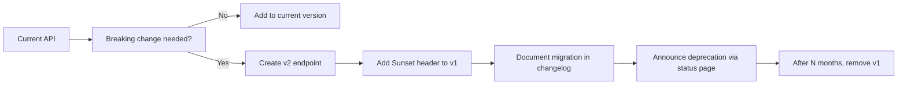

## When to use this skill

Load this skill when designing or implementing a REST API — defining
endpoints, request/response shapes, error codes, or pagination.
Essential for SA during solution design and BE during implementation.
Not needed for frontend-only changes or non-API work.

## Overview

This project follows RESTful conventions with a consistent JSON envelope,
explicit versioning, and standardized error responses. All endpoints
share the same patterns for pagination, rate limiting, idempotency, and
deprecation to reduce cognitive load for API consumers.

---

## Process

### Conventions

- RESTful resource naming: plural nouns, kebab-case (`/api/v1/todo-items`)
- Version prefix: `/api/v1/` for all endpoints
- Standard HTTP methods: GET (read), POST (create), PUT/PATCH (update), DELETE (remove)
- Consistent JSON envelope for all responses

### Response format

```typescript
// Success (single)
{ "data": { ... } }

// Success (list)
{ "data": [...], "meta": { "page": 1, "limit": 20, "total": 100 } }

// Error
{ "error": { "code": "VALIDATION_ERROR", "message": "...", "details": [...] } }
```

### Error codes

- `VALIDATION_ERROR` — malformed payload or missing fields
- `NOT_FOUND` — resource does not exist
- `CONFLICT` — duplicate or state conflict
- `INTERNAL_ERROR` — unexpected server error (never leak stack traces)
- `RATE_LIMITED` — too many requests (see rate limiting below)
- `UPGRADE_REQUIRED` — deprecated API version, client must upgrade

### Status codes

- 200 — GET/PUT success
- 201 — POST created
- 204 — DELETE success
- 400 — validation error
- 404 — not found
- 409 — conflict
- 429 — rate limited (with Retry-After header)
- 500 — internal error
- 501 — not implemented (future endpoint registered but not deployed)

### Pagination Strategy

Choose based on the use case:

| Criteria | Cursor-based | Offset-based |
|----------|-------------|--------------|
| **How it works** | Opaque cursor string (`?cursor=abc123`) | `?page=2&limit=20` |
| **Stable under writes** | ✅ Yes — inserting/deleting records does not shift pages | ❌ No — pages drift if data changes |
| **Real-time feeds** | ✅ Best choice (chat, activity logs, notifications) | ❌ Poor choice |
| **Arbitrary page jumps** | ❌ Cannot jump to page N | ✅ Can jump directly |
| **UI with page numbers** | ❌ Not suitable | ✅ Best choice |
| **Implementation complexity** | Higher (need cursor encoding/decoding) | Lower |

**Decision rule:**
- Use **cursor-based** for dynamic lists or feeds where data changes frequently
- Use **offset-based** only when the UI requires page-number navigation and the list is static during the session

```typescript
// Cursor-based response
{
  "data": [...],
  "meta": {
    "nextCursor": "eyJpZCI6MTAwfQ==",
    "hasMore": true
  }
}

// Offset-based response
{
  "data": [...],
  "meta": {
    "page": 2,
    "limit": 20,
    "total": 100,
    "totalPages": 5
  }
}
```

### Rate Limiting Headers Pattern

Every response should include rate limit headers so clients can adapt:

```http
HTTP/1.1 200 OK
X-RateLimit-Limit: 100          # max requests per window
X-RateLimit-Remaining: 87       # remaining in current window
X-RateLimit-Reset: 1684512000   # Unix timestamp when window resets
Retry-After: 42                 # seconds (only on 429 responses)
```

When exceeded:
```json
{
  "error": {
    "code": "RATE_LIMITED",
    "message": "Too many requests. Retry after 42 seconds.",
    "details": [{ "retryAfter": 42 }]
  }
}
```

### Idempotency Key Pattern

For POST endpoints that create resources (to prevent duplicate charges, duplicate todos, etc.):

```typescript
// Client includes idempotency key in header
POST /api/v1/todo-items
Idempotency-Key: 123e4567-e89b-12d3-a456-426614174000

// Server checks if key was already processed:
//   → First request: process and store { key, response }
//   → Duplicate request with same key: return stored response (idempotent)
//
// Key expires after 24 hours (configurable).
// Server returns 422 if key format is invalid.
```

Implementation guidelines:
- Use UUID v4 for idempotency keys
- Return `201` on first request, `200` on subsequent identical requests with same key
- Return `409 CONFLICT` if the same key is used with a **different** request body
- Store key+response in a cache with TTL (Redis, DynamoDB, etc.)

### Versioning Strategy

| Strategy | Example | When to use |
|----------|---------|-------------|
| **URL prefix** | `/api/v1/todo-items` | Simplest; clear visibility for consumers |
| **Header** | `Accept: application/vnd.todo.v1+json` | Cleaner URLs; version lives in content negotiation |
| **Query param** | `/api/todo-items?version=1` | Easy to test; clutters URLs and can be cached poorly |

**Recommendation for this project:** URL prefix (`/api/v1/`). It is self-documenting, easy to route, and requires no special middleware.

**Version lifecycle:**
1. `v1` is current stable — all new features go here initially behind feature flags
2. When breaking changes are needed, create `v2` with a parallel route
3. `v1` is deprecated with `Sunset` header on every response
4. `v1` is removed after a minimum deprecation period (e.g., 6 months)

### API Changelog / Deprecation Workflow



When deprecating a version, every response must include:

```http
Sunset: Sat, 22 Nov 2026 23:59:59 GMT
Deprecation: true
Link: </api/v2/todo-items>; rel="successor-version"
```

Maintain an `API-CHANGELOG.md` or `/docs/api-changelog.md` that lists:
- Date of change
- Version affected
- Description of the change (new, changed, deprecated, removed)
- Migration path if breaking

### HATEOAS Considerations

HATEOAS (Hypermedia as the Engine of Application State) means API responses
include links that tell the client what actions are possible next.

For this project, a lightweight approach is sufficient:

```typescript
// Response with HATEOAS links
{
  "data": {
    "id": "abc-123",
    "title": "Buy milk",
    "_links": {
      "self": { "href": "/api/v1/todo-items/abc-123" },
      "toggle": { "href": "/api/v1/todo-items/abc-123/toggle", "method": "PATCH" },
      "delete": { "href": "/api/v1/todo-items/abc-123", "method": "DELETE" },
      "collection": { "href": "/api/v1/todo-items" }
    }
  }
}
```

**When to use:** Include links when the API is consumed by a generic client
that discovers actions dynamically. For tightly-coupled FE/BE apps, links
are optional but improve discoverability and reduce hard-coded URL paths.

**When to skip:** For internal-only microservices or when the client is
the only consumer and URLs are already documented.

---

## Common Rationalizations

| Rationalization | Why it's dangerous | What to do instead |
|----------------|-------------------|-------------------|
| "We don't need pagination — there won't be that many records" | Every list grows; clients that fetch everything will break at some threshold | Add cursor pagination from day one — it's cheap to implement and backward-compatible |
| "We'll add versioning later" | Once clients depend on v1 behavior, you can't change it without breaking them | Version from the first endpoint; use URL prefix for simplicity |
| "Rate limiting is premature optimization" | One runaway client (or a bug) can DDoS your API | Implement basic rate limits even in development — they double as abuse prevention |
| "Just send a 500 if something goes wrong" | Clients can't distinguish between retryable and non-retryable errors | Use appropriate 4xx vs 5xx codes and structured error bodies |
| "HATEOAS adds too much complexity for our use case" | For tightly-coupled FE/BE, links aren't essential — but they improve testability and evolvability | Start with no links; add them if the API grows beyond one consumer |

## Red Flags

- ⛔ No version prefix in URL (everything starts as `/api/` with no number)
- ⛔ Inconsistent error format (sometimes `{message}`, sometimes `{error: string}`)
- ⛔ Returning stack traces or internal error messages in production
- ⛔ No pagination on list endpoints (no `limit`/`cursor` or `page` params)
- ⛔ Using GET for mutations or DELETE with a request body
- ⛔ No rate limiting headers on any endpoint
- ⛔ CORS configuration allows any origin (`*` or `Access-Control-Allow-Origin: *`)
- ⛔ API versions removed without a deprecation notice or migration period
- ⛔ Missing `Content-Type` header or inconsistent casing in JSON keys

## Verification Checklist

- [ ] All endpoints follow the URL convention `/api/v1/<resource>`
- [ ] All responses use the consistent JSON envelope (`data`/`error`/`meta`)
- [ ] Error responses include structured code, message, and optional details
- [ ] List endpoints support pagination (cursor or offset) with `meta` block
- [ ] Rate limit headers (`X-RateLimit-*`) present on all responses
- [ ] Idempotency key support considered for POST endpoints
- [ ] Version deprecation includes `Sunset` and `Link` headers
- [ ] HTTP methods correspond to the correct CRUD semantics
- [ ] CORS is not wildcarded — specific origins allowed
- [ ] API changelog maintained for every endpoint change
- [ ] `405 Method Not Allowed` returned for unsupported methods on a route
- [ ] No sensitive data (stack traces, DB queries, tokens) in error responses
